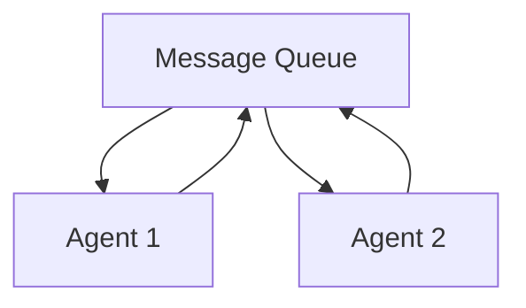

# Decentralized (Choreography)

Decentralized agents react to events and message queues independently, without a central controller. This architecture is highly scalable and resilient.

## Diagram

[<- Back to Home](../README.md)