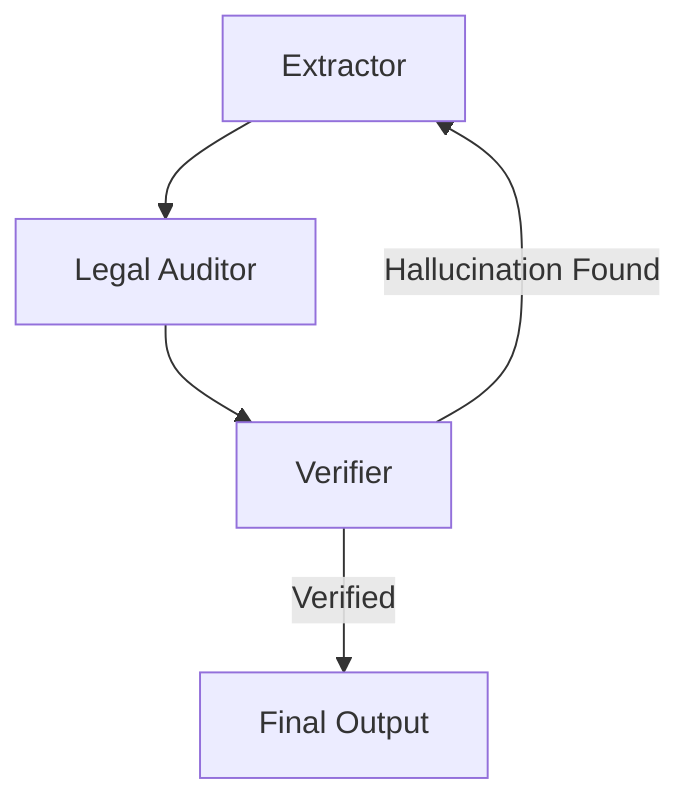

# Reflection & Fact-Checking Chain

A chain focused on accuracy, where an extractor pulls information, an auditor cross-references laws, and a verifier double-checks for hallucinations.

## Diagram

[<- Back to Home](../README.md)