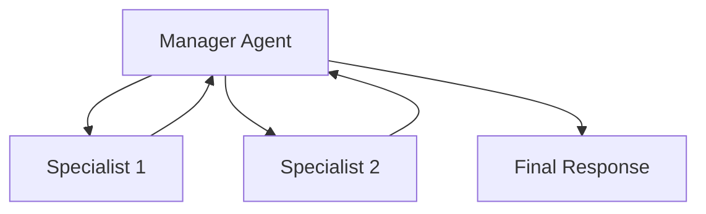

# Hierarchical (Router / Supervisor)

A hierarchical structure uses a centralized supervisor agent to evaluate intents, delegate tasks to sub-agents, and aggregate results. This pattern ensures coordinated problem-solving.

## Diagram

[<- Back to Home](../README.md)