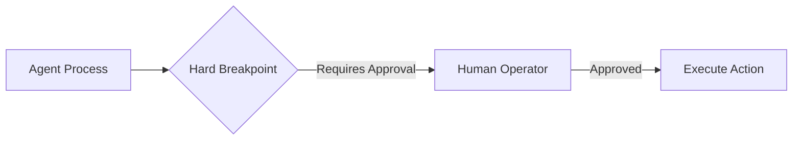

# Human-in-the-Loop (HITL) Workflows

HITL integrates human oversight at critical junctures. This is essential for high-stakes actions like financial transactions, ensuring safety and compliance.

## Diagram

[<- Back to Home](../README.md)