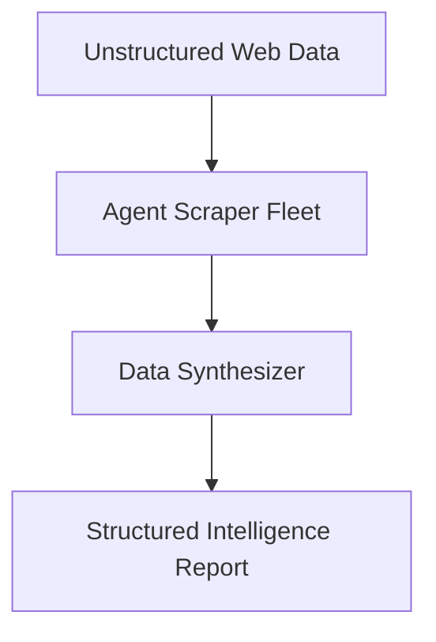

# Market Research Application

Agents gather and synthesize immense amounts of unstructured data from the web, converting it into actionable, structured intelligence reports.

## Diagram

[<- Back to Home](../README.md)