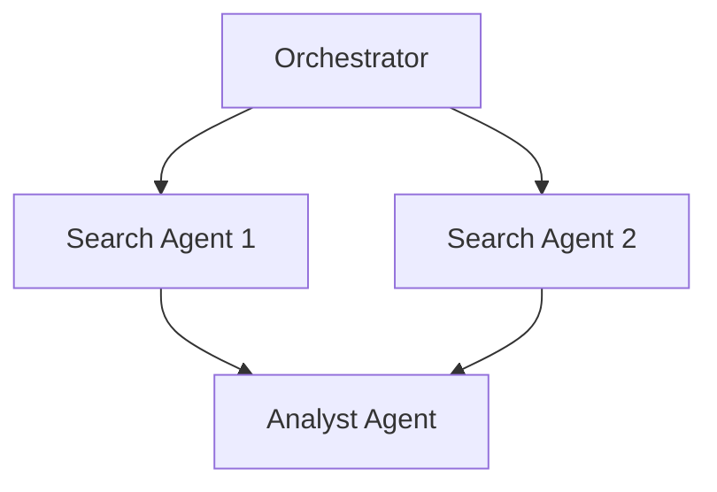

# Parallel Web-Scraping & Synthesizer Teams

Parallel agents handle web scraping, navigating paywalls and pagination, while an analyst agent merges the gathered data.

## Diagram

[<- Back to Home](../README.md)