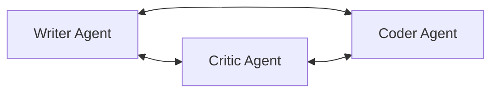

# Multi-Agent Collaboration

Collaboration between specialized agents allows for complex problem solving. Distinct personas share context, review each other's work, and bring specialized skills to a joint task.

## Diagram

[<- Back to Home](../README.md)