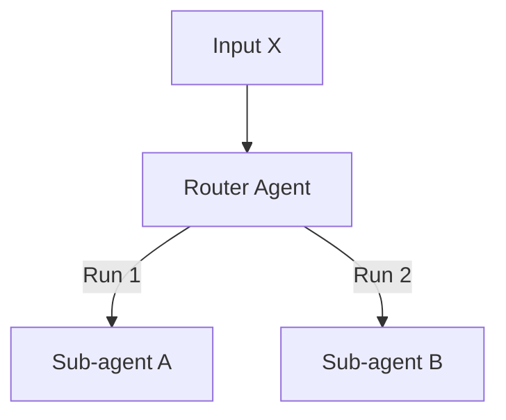

# Non-Deterministic Routing

The inherent non-determinism of LLMs can cause routers to make inconsistent delegation decisions for identical inputs, complicating reliability.

## Diagram

[<- Back to Home](../README.md)