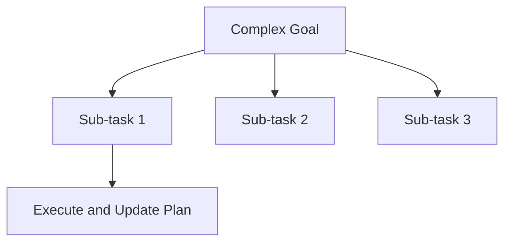

# Planning (Decomposition)

Planning involves decomposing high-level, non-deterministic objectives into manageable, step-by-step tasks. Agents can dynamically adjust the plan as they progress and learn new information.

## Diagram

[<- Back to Home](../README.md)