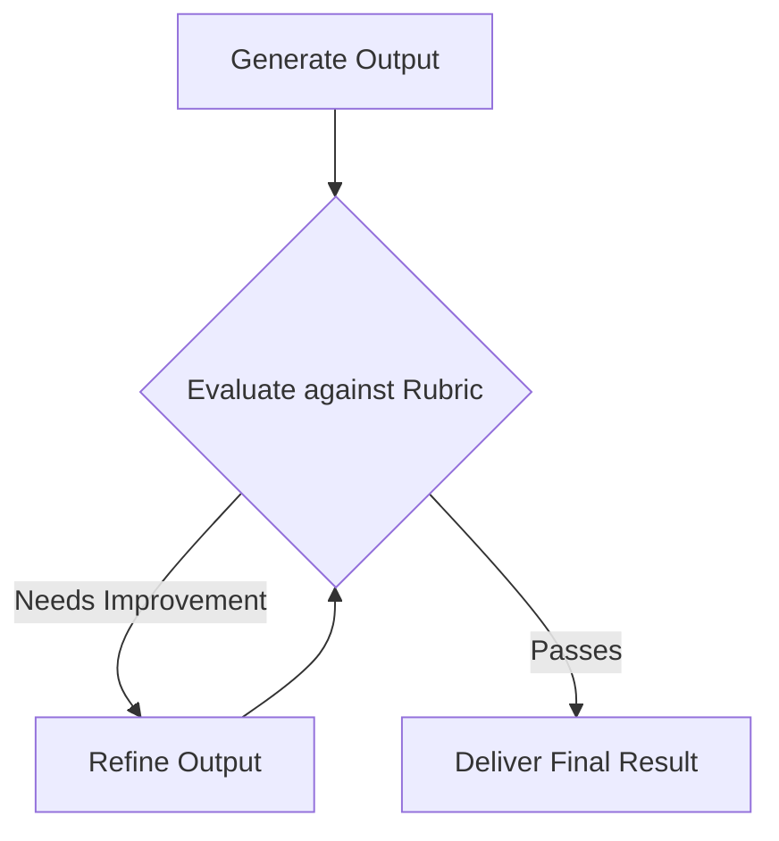

# Reflection & Self-Correction

Reflection and self-correction allow agents to critically analyze their own outputs before finalizing them. This mimics human editing and ensures higher quality and correctness.

## Diagram

[<- Back to Home](../README.md)