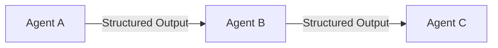

# Sequential / Linear Chains

Sequential chains offer a highly predictable, deterministic pipeline where outputs from one agent feed directly into the next. Ideal for well-defined, multi-step processing tasks.

## Diagram

[<- Back to Home](../README.md)