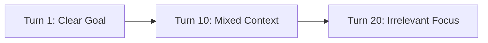

# State Drift

Over long interactions, an agent's context window can become cluttered with irrelevant tool outputs, causing it to lose track of the original goal.

## Diagram

[<- Back to Home](../README.md)