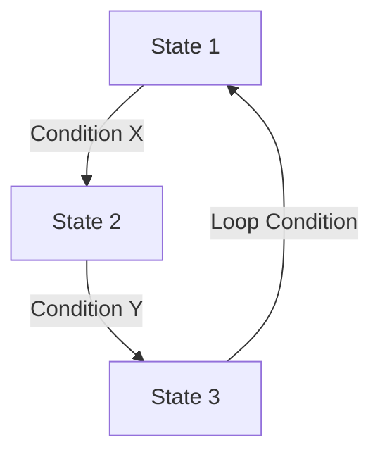

# State-Machine Graph Networks

Modeling workflows as state machines provides precise control over transitions, loops, and conditional logic. Frameworks like LangGraph excel in this paradigm.

## Diagram

[<- Back to Home](../README.md)