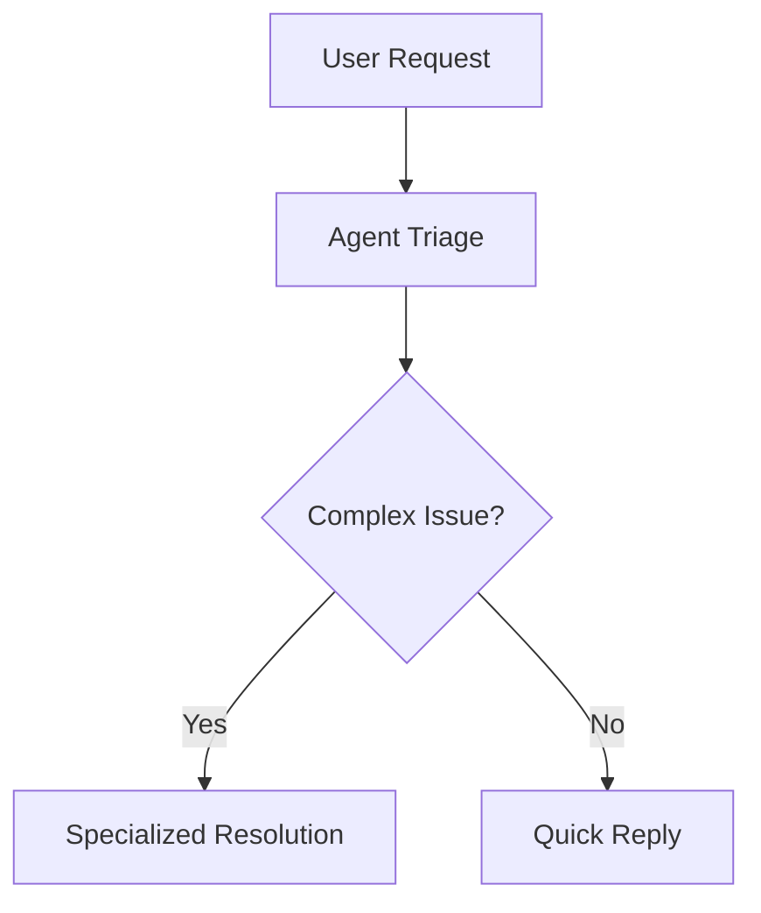

# Customer Support Application

Agents can resolve complex user issues end-to-end, managing workflows like refunds and account migrations autonomously.

## Diagram

```mermaid
graph TD
    A[User Request] --> B[Agent Triage]
    B --> C{Complex Issue?}
    C -- Yes --> D[Specialized Resolution]
    C -- No --> E[Quick Reply]
```

[<- Back to Home](../README.md)