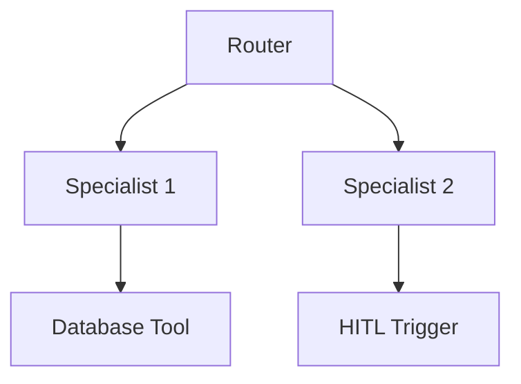

# Hierarchical Supervisor with Tool Access

A hierarchical setup where a router assigns support tickets to specialists equipped with database tools, escalating to humans when necessary.

## Diagram

[<- Back to Home](../README.md)