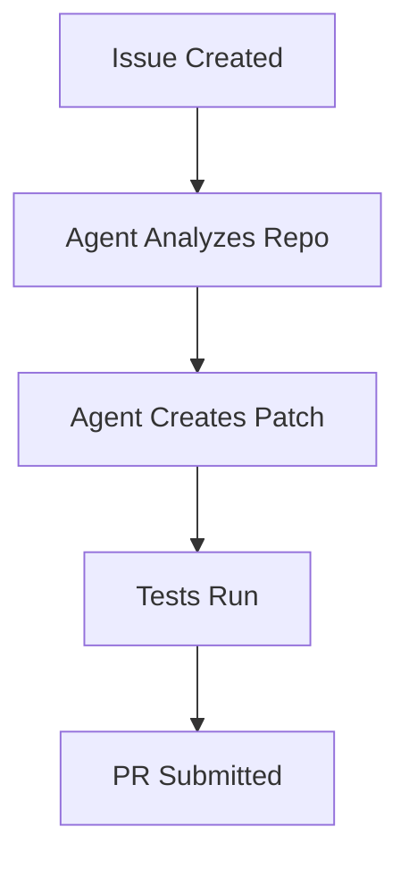

# Software Engineering Application

Agentic workflows revolutionize software engineering by autonomously resolving bugs, generating code patches, and performing repository maintenance tasks.

## Diagram

[<- Back to Home](../README.md)