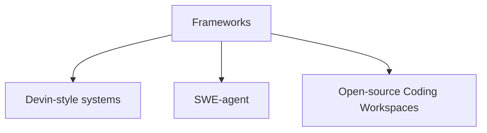

# Software Engineering Framework Examples

Various frameworks support autonomous coding tasks, ranging from closed-source Devin-style systems to open-source alternatives like SWE-agent.

## Diagram

[<- Back to Home](../README.md)