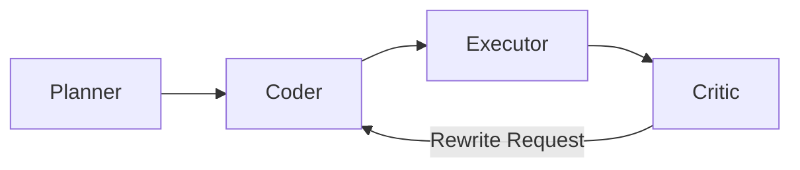

# Multi-Agent Coding Loop

This workflow involves multiple specialized agents working together to iteratively write, test, and refine code.

## Diagram

```mermaid
graph LR
    A[Planner] --> B[Coder]
    B --> C[Executor]
    C --> D[Critic]
    D -- Rewrite Request --> B
```

[<- Back to Home](../README.md)