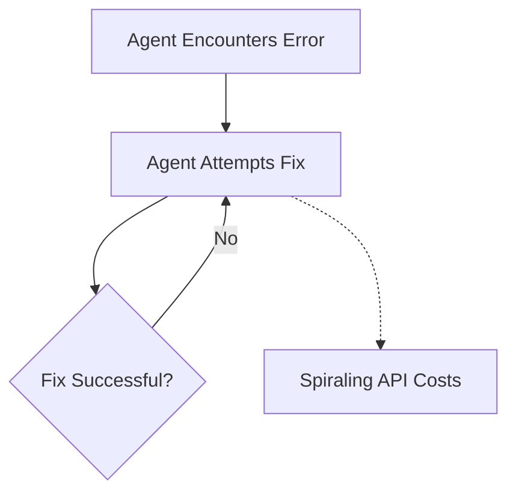

# Token Loop Cascades

A critical failure mode where agents get caught in infinite loops trying to resolve an error, leading to runaway token consumption and high API costs.

## Diagram

[<- Back to Home](../README.md)