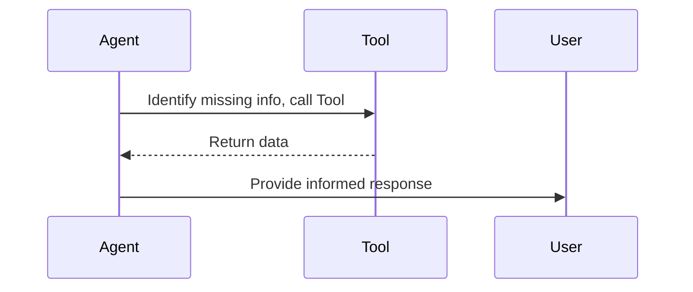

# Tool Use (Function Calling)

By leveraging external tools, APIs, and code execution environments, agents can overcome the limitations of their pre-trained knowledge base and interact dynamically with the real world.

## Diagram

[<- Back to Home](../README.md)